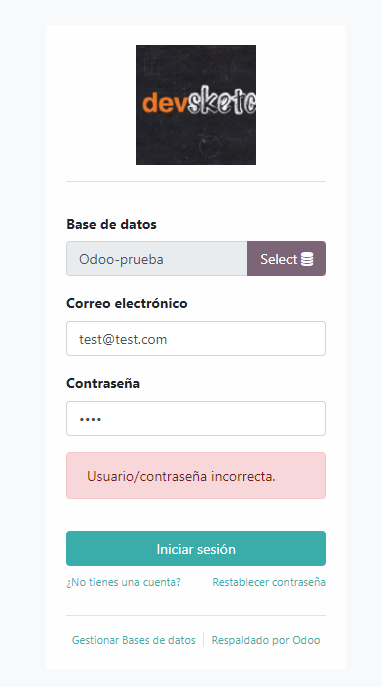
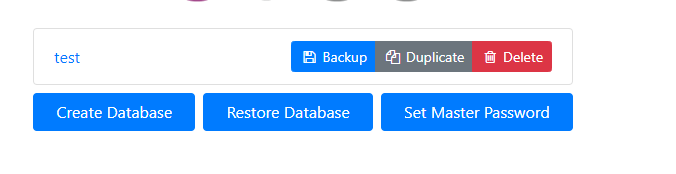

# Ejercicio 2.2 

Tomando como referencia el documento pdf sobre Configuración de Odoo de esta unidad, intenta realizar las siguientes operaciones:

- Crea una nueva base de datos con nombre Odoo-prueba, con idioma español, país España y sin datos de Demo. Muestra que está creada con una captura de pantalla de las bases de datos que puedes seleccionar en la página de Login (1 punto)

- Una vez hayas accedido con el usuario administrador a la base de datos creada, instala el módulo "Proyecto". Incluye captura del nuevo menú desplegable de Odoo (1 punto)

- Crea un proyecto y entra en él. Una vez estés trabajando con ese proyecto localiza las vistas posibles que incluye e indica cómo se llama cada una de ellas. Incluye capturas (2 puntos)

- Cambia el nombre de la compañía y añádele un logo. Incluye captura de pantalla de la página de inicio.  (1 punto)

- Activa la opción de "Sub-tarea" en el módulo de proyecto (docker). Incluye captura.  (1 punto)

- Realiza un backup de la base de datos que creaste en la instalación de Odoo y después bórrala del ERP. Incluye capturas. (1 punto)

- Crea un nuevo usuario con nombre "usuario1", ponle una contraseña y accede a la aplicación con dicho usuario. Incluye captura. (1 punto)

- Crea una compañía con nombre "compañía1". Incluye captura de la existencia de 2 compañías en la aplicación. (1 punto)

- Desinstala ahora el módulo de proyecto. Incluye captura. (1 punto)

