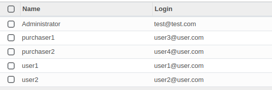
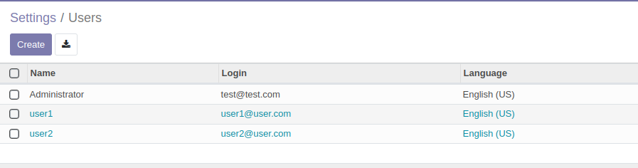

# ejercicio 3.1

## A partir de los pasos indicados en el documento PDF sobre Facturación y Compras de esta unidad.

- Instala el módulo de compras, y crea 2 usuarios nuevos, comprador1 y comprador2, y asigna 2 roles diferentes a ambos compradores (2 puntos). 

  - usuarios creados
  
  
  

- Crea solicitudes de presupuesto a proveedores (2 puntos)

- Descubre diferencias entre los permisos de un comprador y el otro de cara a los pedidos creados (3 puntos).

- Lleva esos presupuestos hasta su último estado detallando los pasos que has tenido que seguir para ello (3 puntos).

