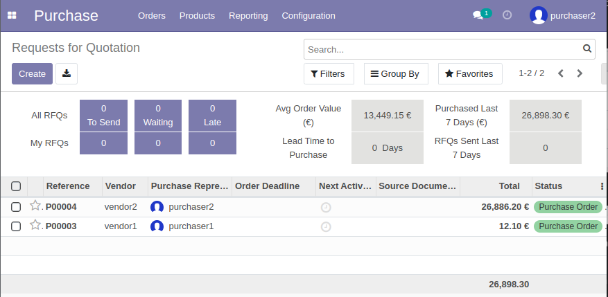

# ejercicio 3.1

## A partir de los pasos indicados en el documento PDF sobre Facturación y Compras de esta unidad.

- Instala el módulo de compras, y crea 2 usuarios nuevos, comprador1 y comprador2, y asigna 2 roles diferentes a ambos compradores (2 puntos). 

  - usuarios creados
  
  

- Crea solicitudes de presupuesto a proveedores (2 puntos)

- Descubre diferencias entre los permisos de un comprador y el otro de cara a los pedidos creados (3 puntos).

las principales diferencias entre los roles de  user y administrador dentro del modulo de compras

### user:
el usuario normal solo tiene acceso a realizar pedidos y ver 
productos

### admin:

el role de administrador le da acceso a todo lo que hay en el user y ademas tiene acceso a metricas y puede configurar propiedades relacionadas con los productos

- Lleva esos presupuestos hasta su último estado detallando los pasos que has tenido que seguir para ello (3 puntos).

1. pasamos de presupuesto a factura, pulsamos en el boton `Create bill`

W
2. registramos el pago podemos hacerlo de varias formas en este caso a traves pago en efectivo, pulsamos primero para confirmar el pago y luego indicamos como ha sido el tipo de pago

3. una vez finalizado el pago vemos como la factura cambia de estado a pagado

