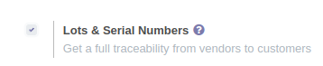
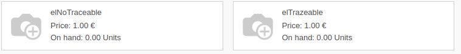
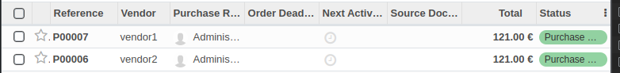
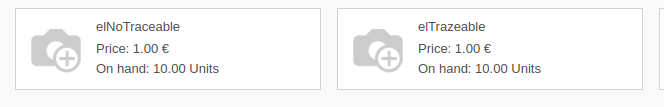
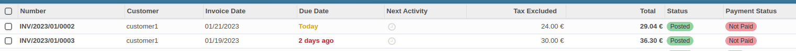
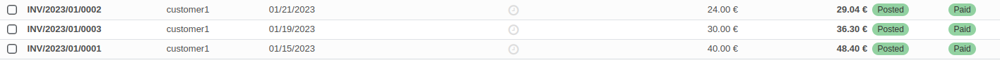
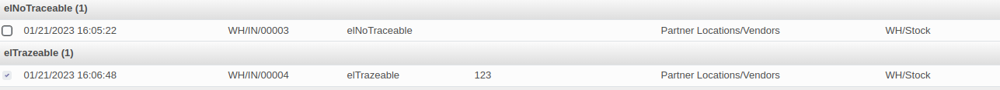
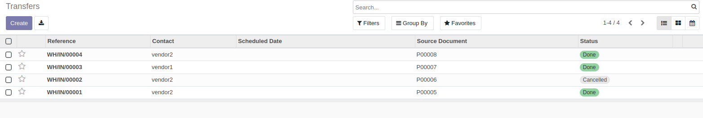

# ejercicio 3.3
A partir de los pasos indicados en el documento PDF sobre Trazabilidad de esta unidad

1. activa el seguimiento por Lotes y Números de Serie en tu aplicación (1 punto) 

2. crea 1 producto "producto_lotes" con seguimiento de la trazabilidad por Lotes y otro producto_sin_seguimiento (1 punto)

3. crea un pedido de compras para abastecer el almacén con unidades de ambos productos (1 punto).

4. Confirma el pedido y recibe la mercancía de esos productos (1 punto).

5. Registra la entrada del producto producto_lotes en 2 lotes diferentes con códigos: LOT0001 y LOT0002 (1 punto). 

6. Consulta el inventario (1 punto).

7. Prepara ahora un pedido de ventas de unidades de ambos productos (1 punto). 

8. Confirma la venta y muestra cómo se han distribuido los productos a vender en el pedido entre los lotes registrados (1 punto). 

9. Muestra el informe de trazabilidad de esa venta (1 punto)

10. comprueba las ubicaciones del producto "producto_lotes" (1 punto).

