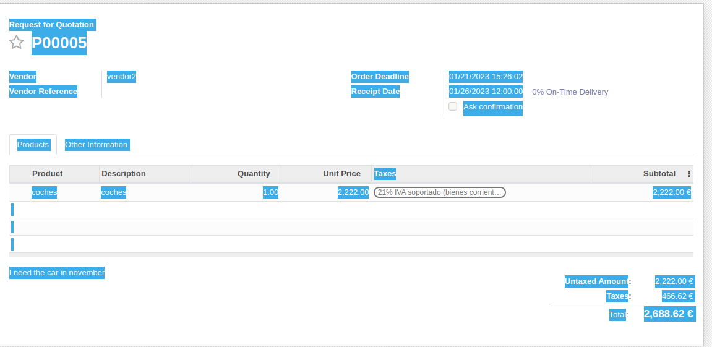
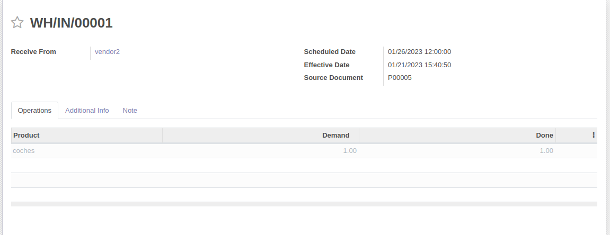

# Ejercicio 3.2

apartir del documento de la plataforma sobre el inventario vamos a realizar una serie de ejercicios

## apartados

1.  instala el módulo de Inventario, crea 2 usuarios nuevos, comprador1 y comprador2, y asigna 2 roles diferentes a ambos compradores (2 puntos). 

- instalar el modulo, para ello vamos a la seleccion de aplicaciones he instalamos el modulo de inventario

- ahora vamos a crear 2 usuarios nuevos para gestionar el inventario

ambos usuarios se crean igual pero cambiamos el rol, pueden ser `administrador` o `usuario`

2.  Crea solicitudes de presupuesto a proveedores (2 puntos)

- 

3. descubre diferencias entre los permisos de un comprador y el otro de cara a los pedidos creados (3 puntos)

para empezar los menus de ambos roles son diferentes

el rol de admin puede
- dentro de operaciones puede
  - manejar transferencias
  - configurar el reabastecimiento
  - ajustar el inventairo
  - establecer tareas
  - crear ordenes para eliminar mercancia
- en el de proudctos
  - puede ver y crear productos nuevos, asi como editarlos o eliminarlos
- en el modulo de reportes:
  - puede desde realizar una auditoria interna
  - ver el estado general del inventario en relacion a los productos
  - y realizar movimiento de productos
- y en configuracion
  - puede realizar diferentes ajuste para el automatismo del modulo de inventario

- para empezar solo tiene acceso a secciones del total del modulo de inventario
- en overview tiene la misma vista que el administrador
- dentro de operaciones puede
  - manejar transferencias
  - configurar el reabastecimiento
  - ajustar el inventario
- en productos solo puede consultar informacion de los diferentes productos

4.  Lleva esos presupuestos hasta su último estado detallando los pasos que has tenido que seguir para ello (3 puntos)

Una vez que teminas el proceso del presupuesto obtenemos el siguiente documento
