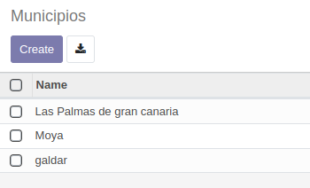
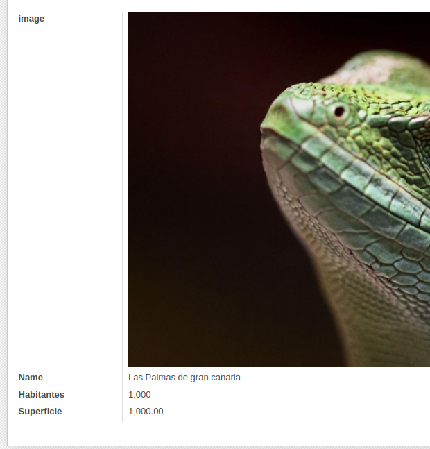
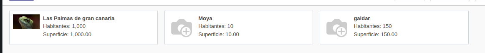
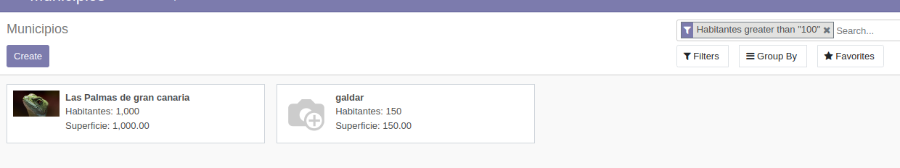

# ejercicio 4.3
Sigue los pasos descritos en el documento PDF "CRUD en la interfaz gráfica de Odoo 14", del apartado Contenidos de esta unidad.

Sube un documento PDF con la siguiente información:

1. Una captura de pantalla de la vista árbol de Municipios con 3 municipios de Gran Canaria creados. (3 puntos)

2. Una captura de pantalla de la vista formulario de 1 municipio de Gran Canaria (3 puntos)

3. Una captura de pantalla de la vista Kanban de Municipios. (2 puntos)

4. Una captura de pantalla de la vista de búsqueda incluyendo un filtro. (2 puntos)

