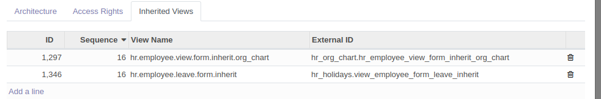
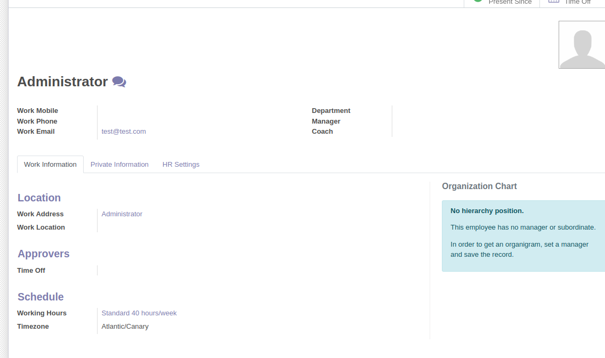

# ejercicio 4.4. Vistas heredadas.

Sigue los pasos descritos en el documento PDF "Las vistas heredadas", del apartado Contenidos de esta unidad.

1. Una captura de pantalla de la vista formulario de Empleados, con el nuevo campo añadido mediante la vista heredada. (5 puntos)

2. Una captura de pantalla con la vista heredada creada en Empleados (5 puntos)

