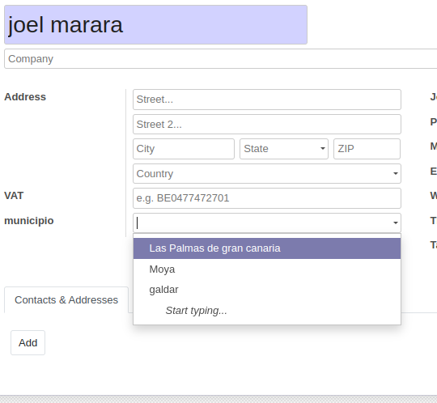
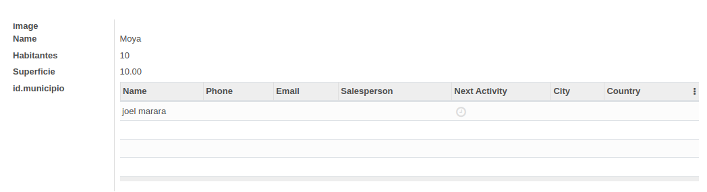

# Ejercicio 4.5. Subformularios en Odoo 14.

Sigue los pasos descritos en el documento PDF "Subformularios en Odoo 14", del apartado Contenidos de esta unidad.

1. Una captura de pantalla de la vista formulario de Clientes, con el campo desplegable de municipios creado (5 puntos)

2. Una captura de pantalla de la vista formulario de Municipios, con el subformulario de clientes creado (5 puntos)

