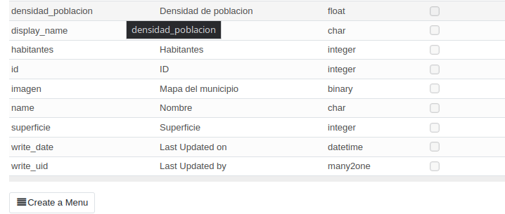
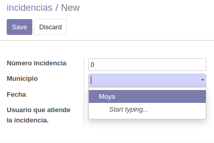
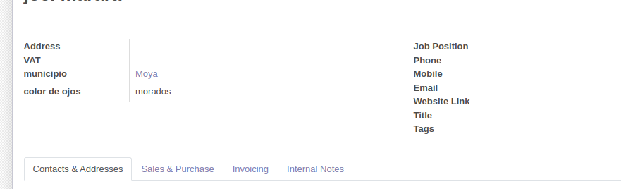

# Ejercicio 5.2 Campos calculados, Many2one y herencia.

1. Incluye en la aplicación que creaste en la actividad anterior, un campo calculado (2 puntos)

2. un campo one2many y otro many2one (2 puntos). 

3. Instala la aplicación de Facturación, agrega un campo nuevo al modelo Clientes y muéstralo en la vista formulario (2 puntos).

4. Asigna permisos por defecto al usuario administrador al instalar tu aplicación (2 puntos).

5. define un campo de una de tus istas que sólo pueda ser visible por un nuevo usuario que debes crear antes (2 puntos).

