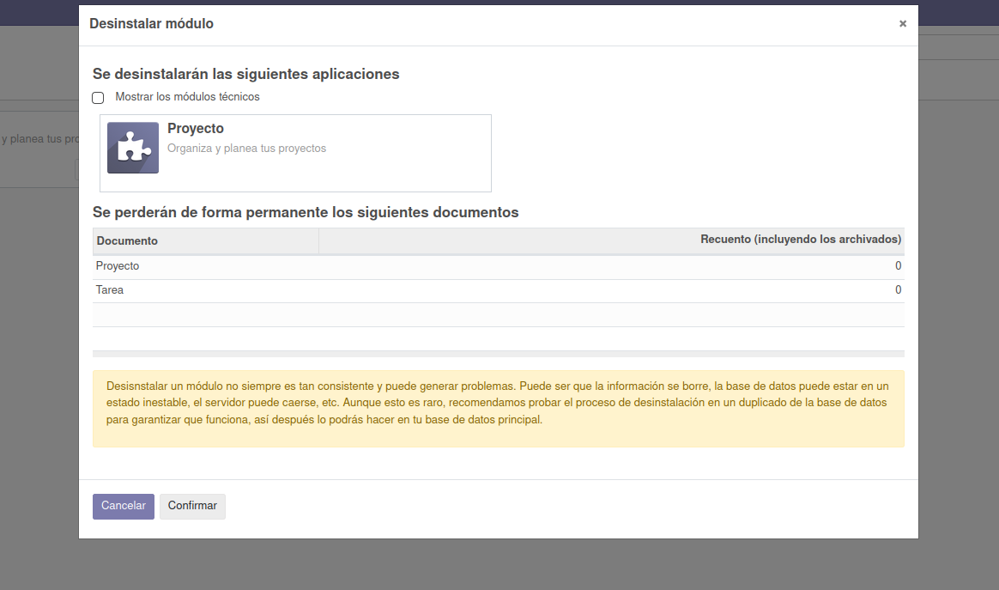
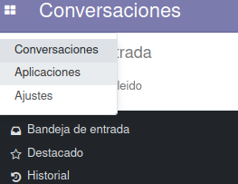

# Ejercicio 2.2 

Tomando como referencia el documento pdf sobre Configuración de Odoo de esta unidad, intenta realizar las siguientes operaciones:

 - Crea una nueva base de datos con nombre Odoo-prueba, con idioma español, país España y sin datos de Demo. Muestra que está creada con una captura de pantalla de las bases de datos que puedes seleccionar en la página de Login.

 - Una vez hayas accedido con el usuario administrador a la base de datos creada, instala el módulo "Proyecto". Incluye captura del nuevo menú desplegable de Odoo.

 - Crea un proyecto y entra en él. Una vez estés trabajando con ese proyecto localiza las vistas posibles que incluye e indica cómo se llama cada una de ellas. Incluye capturas.

    Vistas posibles (de izquierda a derecha):  
        - kanban
        - list
        - calendar
        - pivot
        - graph
        - activity

 - Cambia el nombre de la compañía y añádele un logo. Incluye captura de pantalla de la página de inicio.

 - Activa la opción de "Sub-tarea" en el módulo de proyecto (docker). Incluye captura.

 - Realiza un backup de la base de datos que creaste en la instalación de Odoo y después bórrala del ERP. Incluye capturas.

 - Crea un nuevo usuario con nombre "usuario1", ponle una contraseña y accede a la aplicación con dicho usuario. Incluye captura.

 - Crea una compañía con nombre "compañía1". Incluye captura de la existencia de 2 compañías en la aplicación.

 - Desinstala ahora el módulo de proyecto. Incluye captura.

