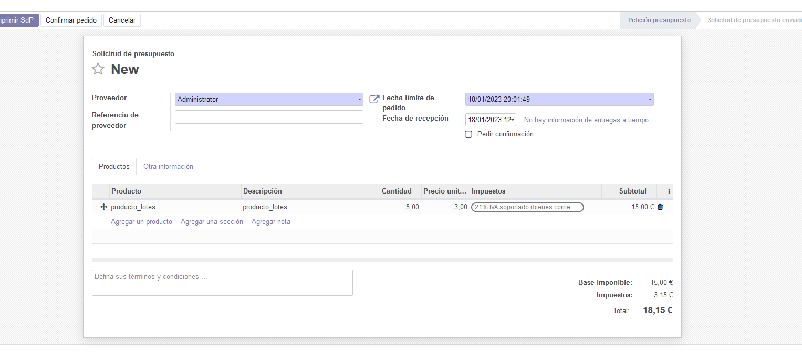
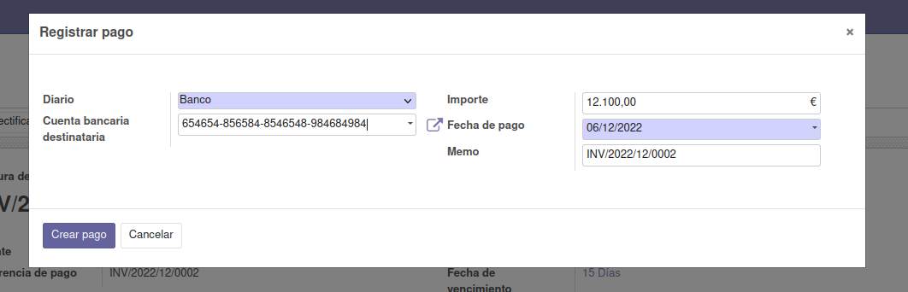

# Ejercicio 3.1

# A partir de los pasos indicados en el documento PDF sobre Facturación y Compras de esta unidad.

- Instala el módulo de compras, y crea 2 usuarios nuevos, comprador1 y comprador2, y asigna 2 roles diferentes a ambos compradores.

- Crea solicitudes de presupuesto a proveedores.

- Descubre diferencias entre los permisos de un comprador y el otro de cara a los pedidos creados.

    En mi caso le he dado permisos para ambas secciones (facturación y ventas) a los dos usuarios creados, pero a cada uno con un nivel de acceso distinto.

    Una de las primera diferencias que se notan es que en la parte de ventas, a la hora de generar un presupuesto, el _comprador1_ no puede crear productos.

    Otra diferencia es que el _comprador1_, comparado con el _comprador2_, tan sólo puede ver sus propios presupuestos en el listado de presupuesto.

    

- Lleva esos presupuestos hasta su último estado detallando los pasos que has tenido que seguir para ello.

1. Primero convertimos el prespuesto en una factura 

2. Entonces se nos generará un borrador de factura

3. Al confirmarla, pasará a ser una factura con número identificativo único

4. Cuando pasamos a la parte de generar el pago, que es el siguiente paso, se rellenan los datos de pago y se confirma

5. Una vez realizado el pago, la factura cambiará de estado y esto se reflejará en su ventana

6. Por último, en el listado de factura podremos ver el estado de esta factura como pagada y finalizada

