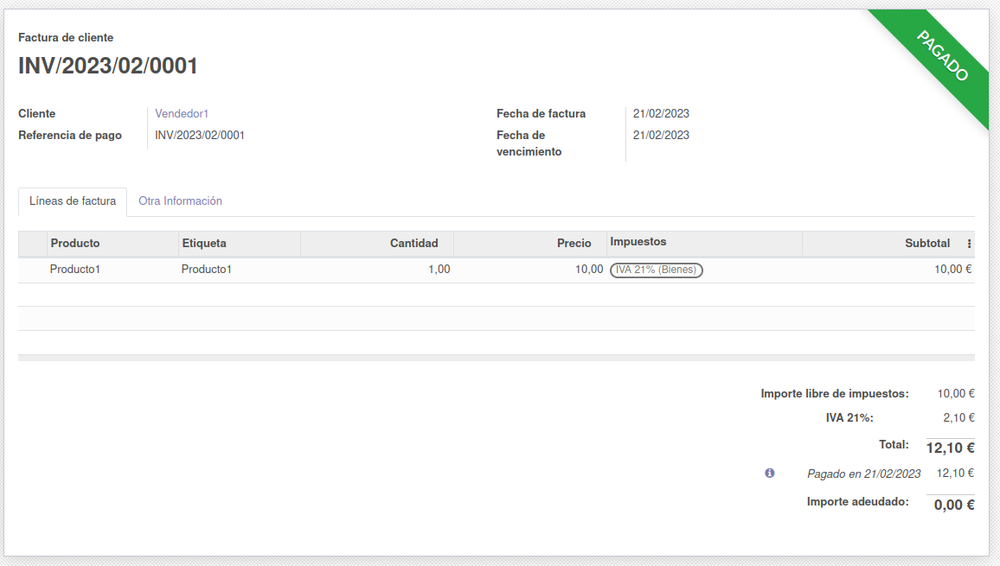

# Ejercicio 3.2

# Módulos de Facturación y Ventas.

- A partir de los pasos indicados en el documento PDF sobre Facturas y Ventas de esta unidad, instala ambos módulos y crea 2 usuarios nuevos, vendedor1 con el rol de ventas "Usuario: solo mostrar documentos propios" y vendedor2 con el rol de Contabilidad "Facturación"

- Crea presupuestos a clientes 

- Lleva esos presupuestos hasta su último estado posible con el vendedor1 detallando los pasos que has tenido que seguir para ello

- Posteriormente llévalos hasta el final (estado Pagado) con el vendedor2

