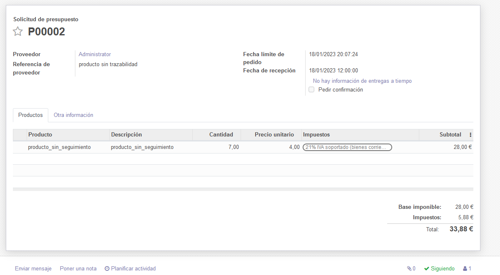
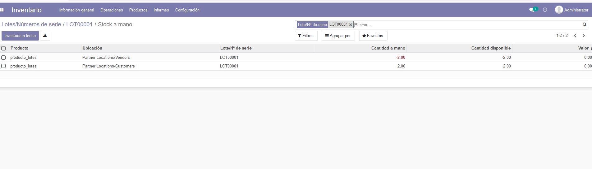

# Ejercicio 3.3

# Trazabilida de productos.

 - A partir de los pasos indicados en el documento PDF sobre Trazabilidad de esta unidad, activa el seguimiento por Lotes y Números de Serie en tu aplicación 

- Crea 1 producto "producto_lotes" con seguimiento de la trazabilidad por Lotes y otro producto_sin_seguimiento

- Crea un pedido de compras para abastecer el almacén con unidades de ambos productos 

- Confirma el pedido y recibe la mercancía de esos productos

- Registra la entrada del producto producto_lotes en 2 lotes diferentes con códigos: LOT0001 y LOT0002 

- Consulta el inventario

- Prepara ahora un pedido de ventas de unidades de ambos productos

- Confirma la venta y muestra cómo se han distribuido los productos a vender en el pedido entre los lotes registrados

- Muestra el informe de trazabilidad de esa venta y comprueba las ubicaciones del producto "producto_lotes"

