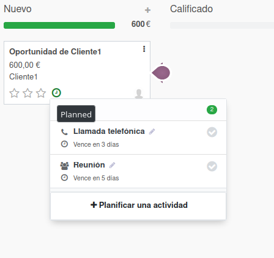

# Ejercicio 3.4

# El módulo CRM.

- A partir de los pasos indicados en el documento PDF sobre el CRM de esta unidad, instala el módulo CRM, y crea un flujo de ventas para el Cliente1 con el nombre de oportunidad "Venta-producto-lotes" y con un ingreso esperado de 600€ 

- Planifica 2 actividades futuras para realizar un seguimeiento a dicha oportunidad, una llamada telefónica a los 3 días y una reunión a los 5 días

- El cliente nos ha dicho que le puede interesar la oferta, por lo que quiere reunirse el día siguiente a las 11 de la mañana, por lo que debes crear también dicha reunión

- También debes promocionar la oportunidad a la siguiente etapa de estado de la oportunidad, que es Calificado

- Decidimos por nuestra cuenta mejorar la oferta y dejarla en 550€, realizando a su vez un presupuesto al cliente, vinculado a nuestra oportunidad, por lo que ahora promocionamos la oportunidad al estado Propuesto

- Finalmente el cliente acepta el presupuesto, la oportunidad pasa a estado Ganado, se confirma el presupuesto y se evoluciona hasta el estado Facturado

