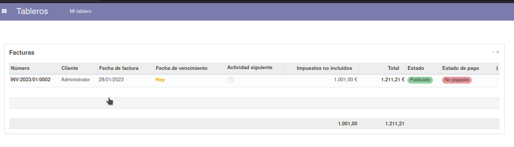

# Ejercicio 3.5

# Usuario y Grupos.

- Siguiendo los pasos del documento PDF sobre Usuario y Grupos, instala el módulo Tablero, y crea un usuario que tenga acceso desde su tablero a todas las facturas a clientes de la empresa con un importe superior a 1000€

- El usuario sólo debe tener acceso a esas facturas  y no al resto de facturas a clientes de la empresa

- Este usuario debe acceder también a todas las facturas de proveedor con importe superior a 500€

- No debe poder acceder al resto de facturas de proveedor de la empresa

