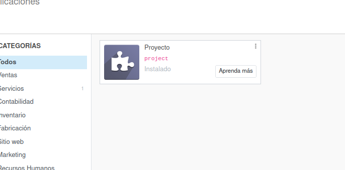

# Ejercicio 3.6

# El módulo de proyecto.

- Siguiendo los pasos del documento PDF Proyecto de esta unidad, instala el módulo de Proyecto y crea un proyecto con nombre Proyecto_prueba con 5 etapas: Por hacer, Iniciado, En proceso, Bloqueado y Finalizado

- Crea 3 tareas dentro de este proyecto: Tarea1, Tarea2 y Tarea3

-  Planifica una actividad de tipo Reunión para cada una de las tareas

- Configura la aplicación para que se puedan registrar partes de horas. Asigna 2, 4 y 6 horas iniciales planificadas, a cada una de ellas por ese orden. Inicia las 3 tareas

- Al finalizar las tareas, el usuario programador1 habría trabajado en ellas 1, 2 y 3 días respectivamente (divide el tiempo dedicado en horas a cada una de ellas entre partes de horas, hasta completar las horas iniciales planificadas entre los días que el programador1 ha dedicado)

- Finaliza las tareas y muestra una imagen con el estado final del proyecto con las tareas finalizadas 

