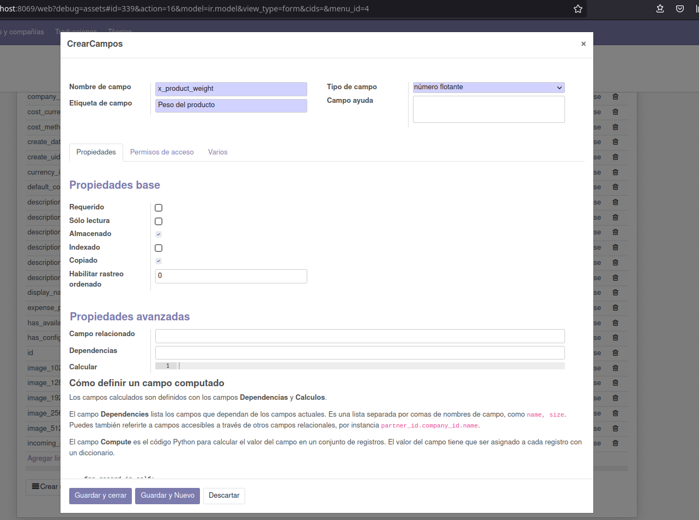
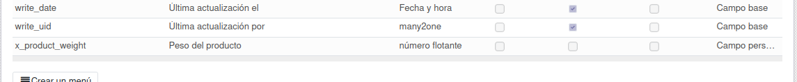
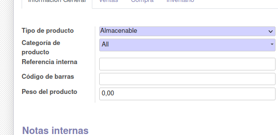
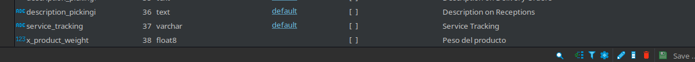

# Ejercicio 4.2

# Modelos y Vistas de Odoo 14.

- Utiliza el documento PDF "Elementos Técnicos de Odoo" para agregar un nuevo campo al formulario de Productos que indique el peso del producto.

Para ello debes crear el campo en el modelo correspondiente

- Agregar el campo en la vista formulario de Productos

- Comprueba que el campo efectivamente se ha creado en la tabla correspondiente de la base de datos utilizando la herramienta PgAdmin

