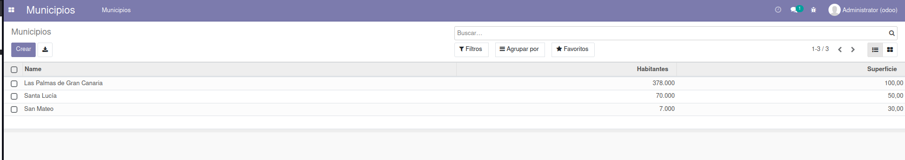
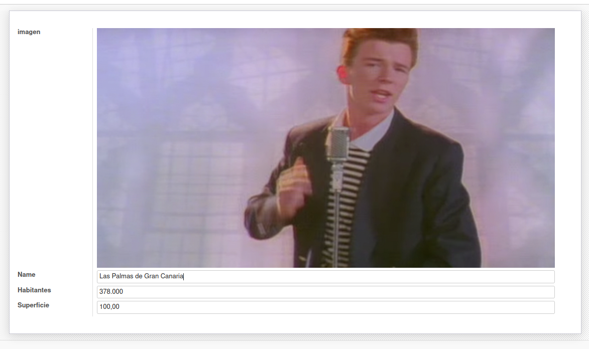
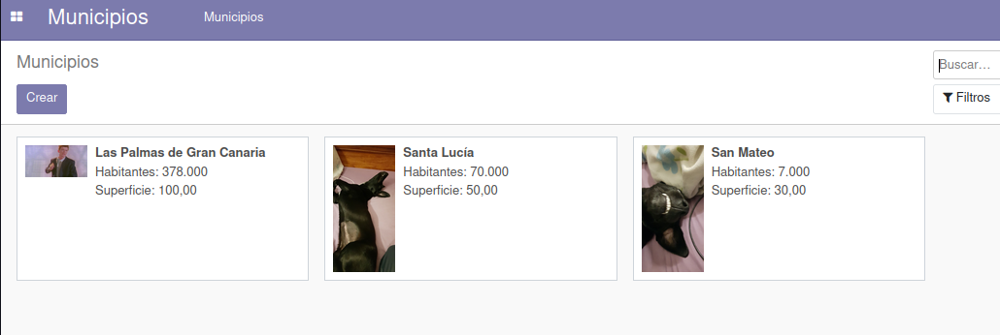
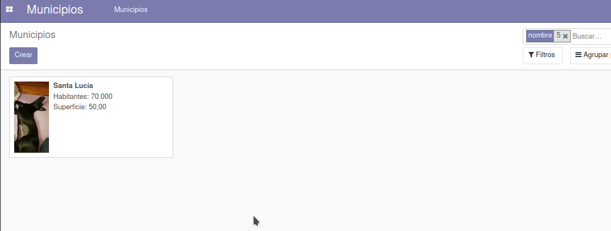

# Ejercicio 4.3

# Modelos y Vistas de Odoo 14.

- Una captura de pantalla de la vista árbol de Municipios con 3 municipios de Gran Canaria creados.

- Una captura de pantalla de la vista formulario de 1 municipio de Gran Canaria

- Una captura de pantalla de la vista Kanban de Municipios

- Una captura de pantalla de la vista de búsqueda incluyendo un filtro

