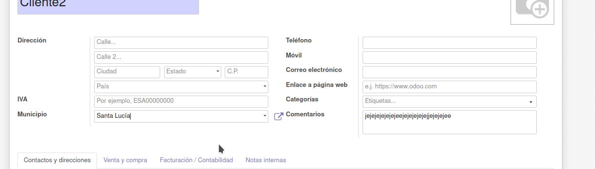
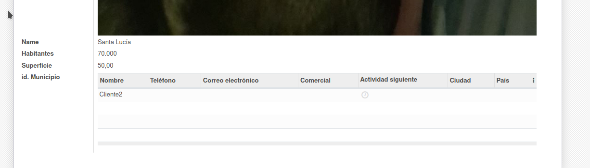

# Ejercicio 4.5

# Subformularios en Odoo.

- Una captura de pantalla de la vista formulario de Clientes, con el campo desplegable de municipios creado

- Una captura de pantalla de la vista formulario de Municipios, con el subformulario de clientes creado

