# Ejercicio 5.1

# Módulo personalizado con Odoo.

- Una captura de pantalla con la lista de modelos creados, realizada desde el entorno gráfico de Odoo, y otra captura con el código correspondiente a las clases vinculadas.

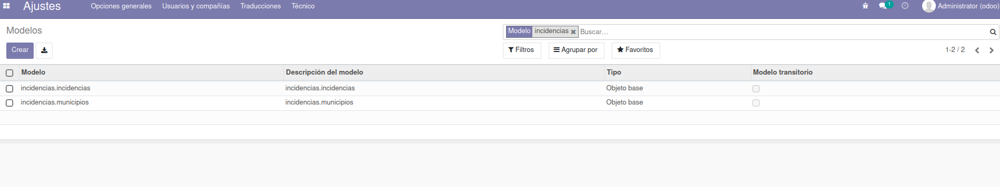
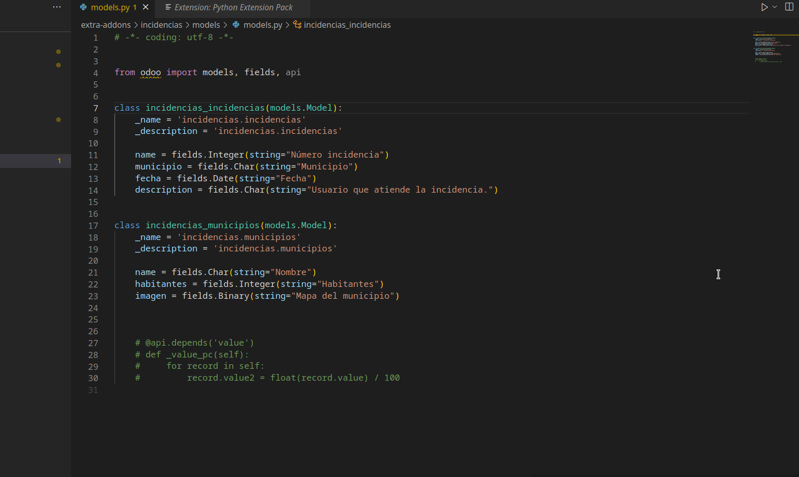

- Una captura de pantalla con la lista de vistas creadas, realizada desde el entorno gráfico de Odoo, y otra captura con el código correspondiente a dichas vistas.

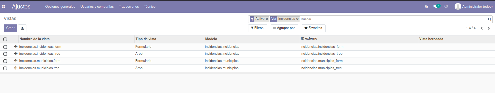
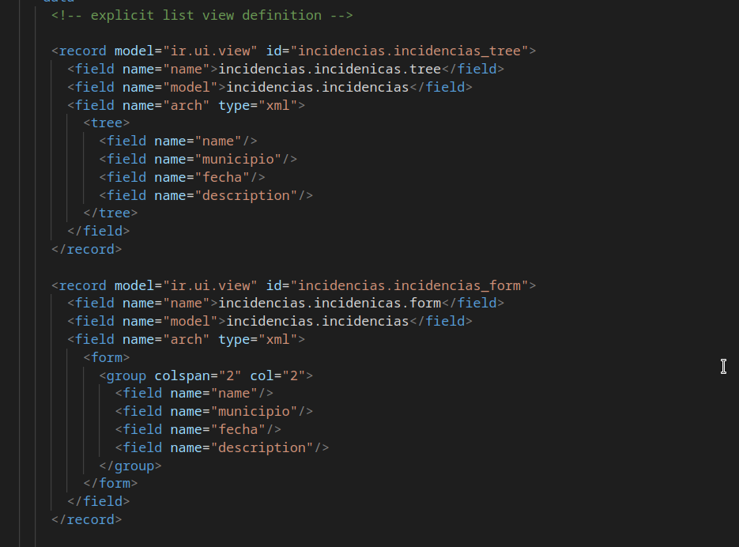
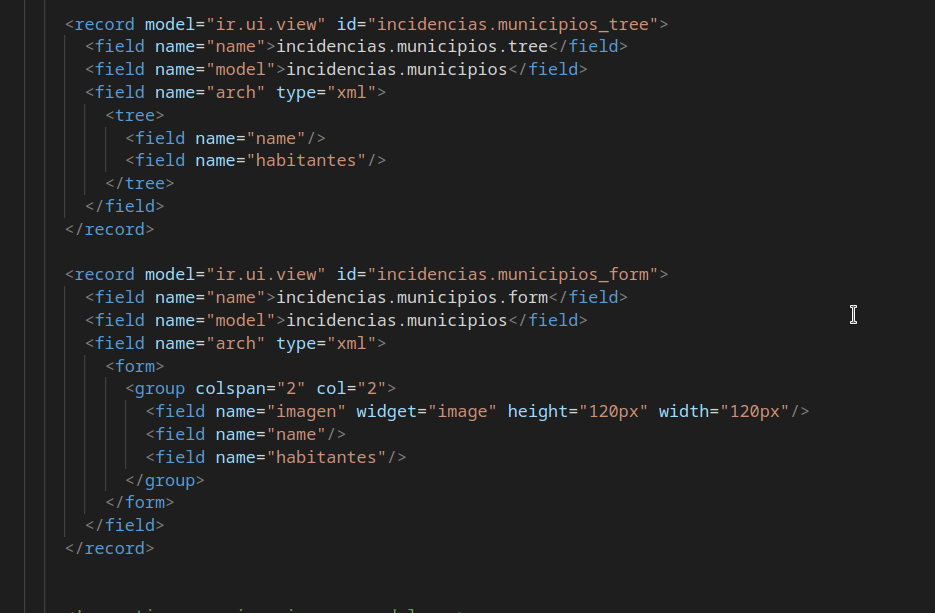

- Una captura de pantalla con la lista de acciones creadas, realizada desde el entorno gráfico de Odoo, y otra captura con el código correspondiente a dichas acciones.

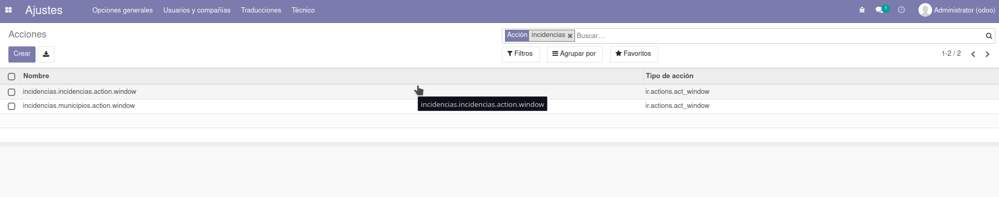
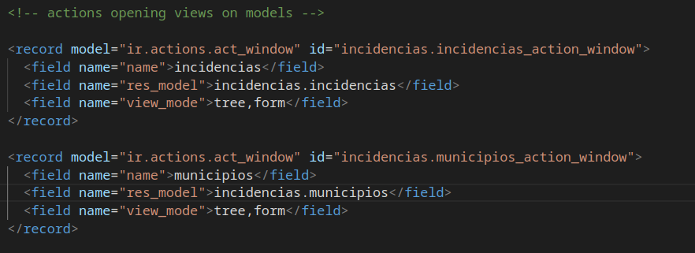

- Una captura de pantalla con la lista de elementos de menú creados, realizada desde el entorno gráfico de Odoo, y otra captura con el código correspondiente a esos elementos de menú. 

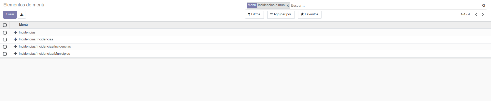
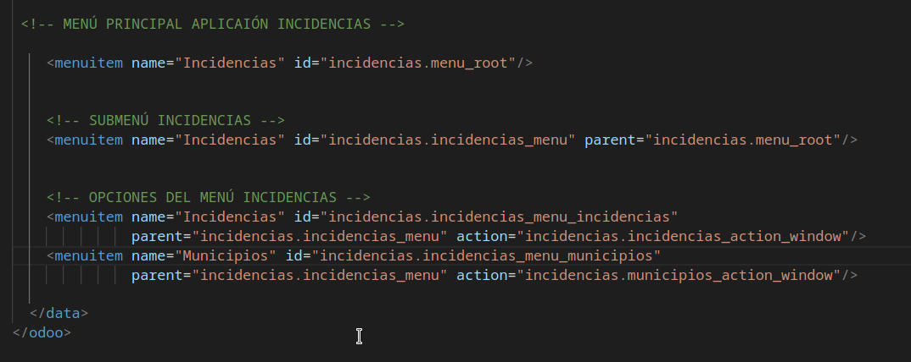

- Una captura de pantalla con los grupos de usuarios creados, realizada desde el entorno gráfico de Odoo, y otra captura con el código correspondiente a esos grupos y sus permisos. 

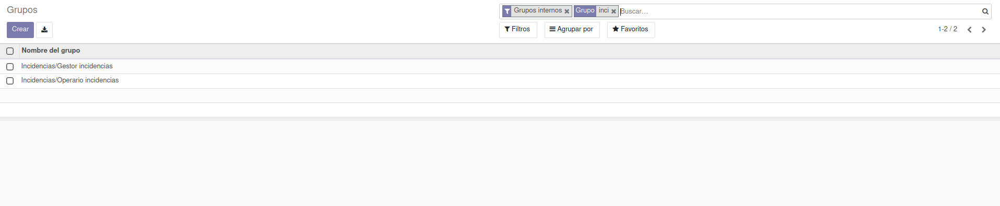
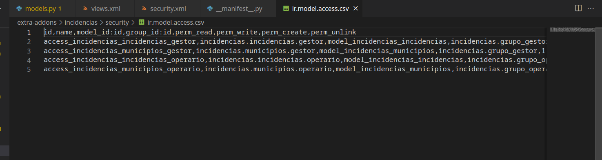
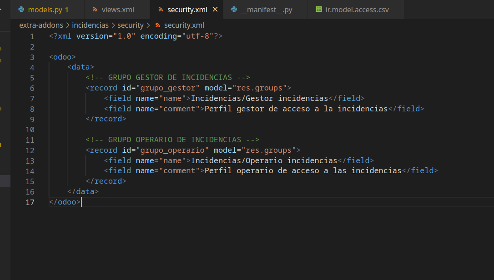

