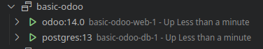
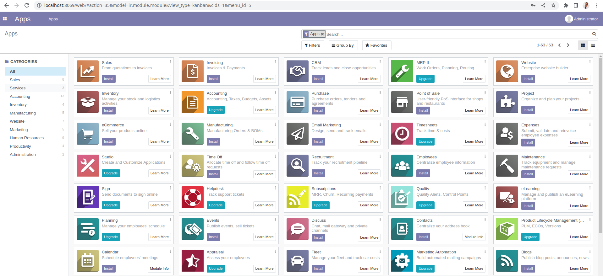

# Start whit 🚀 odoo 🚀

## Despliegue en la nube ☁️

Una gran ventaja de desplegar un servicio en la nube es que no necesitamos de una máquina física para montar ninguno de los servicios. Además nos despreocupamos del mantenimiento o el control de versión de el software.

Sin embargo, tenemos un inconveniente y es que si nuestra aplicación crece y necesitamos más módulos o necesitamos más de una aplicación el coste de la nube iría en aumento y es posible que eso no sea lo que queremos.

Podemos resumir lo siguiente:
  - Pros:Tener de forma externa, tanto la maquina como el mantenimiento de la misma (incluido el software). 
  - Contras: El coste de tener ese servicio nos ira saliendo más caro a medida que necesitemos mas módulos o más aplicaciones.

Los pasos para realizar un despliegue en la nube se definen mas adelante.

1. necesitamos una cuenta en odoo. 

  - Sólo necesitamos seguir los pasos [aquí](https://www.odoo.com/web/login)

  

2. Hacer un despliegue sencillo en odoo:
  - Pulsamos sobre el botón `Try it free`
  - Se nos mostrará una serie de servicios que nos da odoo. Para este ejemplo usaremos un website.

  
  
  - Rellenamos como se va a llamar nuestra app y lo que nos haga falta y aceptamos:
  

  - Seguimos el tutorial:
  

  - Una vez finalizado el tutorial podemos ver nuestra web y compartir el enlace: 
  # [🖥](https://thethreedevsketters.odoo.com/)

3. Comenzar a dar funcionalidad a nuestra aplicación mediante módulos o siguiendo los tutoriales de odoo.

## Despliegue en un servidor local

Un despliegue en una máquina local nos da el control total de la aplicación y de lo que podemos hacer en la máquina. Podríamos necesitar otros servicios que no sean odoo.

Sin embargo este tipo de despliegue tiene los siguientes inconvenientes, tendríamos que encargarnos del mantenimiento de la misma, desde el consumo eléctrico hasta subir de versiones en caso de que sea necesario. Además tenemos que tener en cuenta que la máquina puede fallar y necesitamos una forma de salvaguardar el estado de la misma en diferentes momentos del tiempo(copias de seguridad de la máquina y de la bbdd).

Hoy en día no creo que sea lo más adecuado, hacer un despliegue en local por que además de la máquina, si queremos que nuestra aplicación o servicio sea accesible desde cualquier lugar, necesitamos un dominio al cual apuntar desde fuera y una ip estática. Así mismo, los costes de mantenimiento y el control de seguridad son muy costosos.
Sin Embargo si queremos tener un control total de lo que pasa podría ser una buena idea.

Para este paso sólo necesitamos descargarnos el servicio como indica en la página de odoo.

Mira el siguiente [enlace](https://www.odoo.com/page/download) aquí podrás descargar odoo para windows o linux.

- [Instalación en windows](https://www.odoo.com/documentation/16.0/administration/install/install.html#windows)
- [Instalación en ubuntu](https://www.odoo.com/documentation/16.0/administration/install/install.html#prepare)

En ambos sistemas operativos necesitamos tener instalados el servicio de base de datos de postgreSql.

## Despliegue en máquina virtual de un servidor local 

El despliegue en una máquina virtual tiene los mismos pros e inconvenientes que hacerlo en una máquina física. Aunque de este modo es posible que ganemos a la hora de guardar la información o recuperar la máquina en momentos críticos, ya que, si la maquina se cae, sólo necesitamos volver a iniciar la máquina virtual en un punto en concreto donde todo funcione bien (esto se realiza mediante una snapshot, que es como una copia en un momento concreto de la máquina.).

Además el proceso de virtualización tiene otro coste. Éste, podría ser la latencia que se puede llegar a producir en el equipo.

Para instalar el sistema de odoo en una máquina virtual podemos seguir los pasos del punto anterior, sólo tenemos que tener en cuenta que SO vamos a virtualizar.

## Despliegue con sistema de servidor de aplicaciones en local usando contenedores (docker)

El despliegue en docker nos facilita a la hora de montar un servicio de odoo por nuestra cuenta. Podemos hacerlo en cualquiera de los SO más utilizados como son `windows` o `linux`(ubuntu/debian/otros).

Tanto para levantar una máquina virtual como para levantar un contenedor de docker necesitamos una máquina física, pero en el caso de docker tenemos que tener en cuenta que lo que vamos a virtualizar es exactamente lo que necesita el servicio para que éste funcione.

Además es más fácil separar las copias de seguridad de la base de datos de las imágenes de odoo y ambos servicios pueden estar levantados por separado dentro del mismo contenedor. Así, si uno de los 2 cae sólo tenemos que reiniciar el contenedor caído y todo volvería a estar listo en cuestión de segundos.

## Crear y subir un documento con la información pedida para presentárselo a una posible empresa cliente. 

Para la aplicación de la empresa nosotros recomendaríamos trabajar o bien con Docker o con la nube:

### Por que la nube ☁️
Con la nube ganamos por un lado en velocidad a la hora de montar lo que necesitemos y por otro también en despreocuparnos de las máquinas o copias de seguridad de la información.

Por otro lado es posible que a la larga el coste de mantenimiento de este servicio crezca a medida que la aplicación necesita nuevas funcionalidades. Y si queremos hacer una migración en el futuro, ésta sería muy costosa.

### Docker y sus bondades

Con docker vamos a necesitar un espacio o máquina donde instalarlo, además de un dominio. Sin embargo, si a la larga la empresa necesita implementar nuevos desarrollos, será más barato ya que sólo tenemos que ir modificando el proyecto de odoo a nuestro antojo dentro del contenedor.

Realizar el proyecto con docker nos da mas flexibilidad a la hora de desarrollar nuevas funcionalidades pero también implica una mayor complejidad para llevarlas a cabo.

##  Instala docker en tu sistema. Si ya tienes conocimientos sobre docker, puedes utilizar la forma que prefieras para instalarlo

### Idaira

- Sistema operativo elegido, versión y si han usado o no el subsistema wsl. :
    En mi caso el contenedor de Odoo y PostgresSql se ha realizado en Windows 11 sin wsl.
- Una captura de pantalla donde se muestren los contenedores de Odoo iniciados. 
    
- Una captura de pantalla con la web de presentación de la aplicación Odoo. 
### Adriel
- Sistema operativo elegido, versión y si han usado o no el subsistema wsl.

En mi caso he decidido usar Ubuntu para levantar un contenedor de odoo + PostgreSQL

- Una captura de pantalla donde se muestren los contenedores de Odoo iniciados.

- Una captura de pantalla con la web de presentación de la aplicación Odoo. 

### Nestor
- Sistema operativo elegido, versión y si han usado o no el subsistema wsl. 
- Una captura de pantalla donde se muestren los contenedores de Odoo iniciados. 
- Una captura de pantalla con la web de presentación de la aplicación Odoo. 
