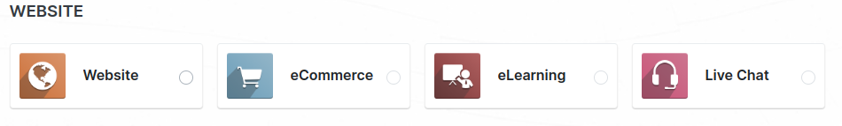
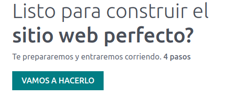
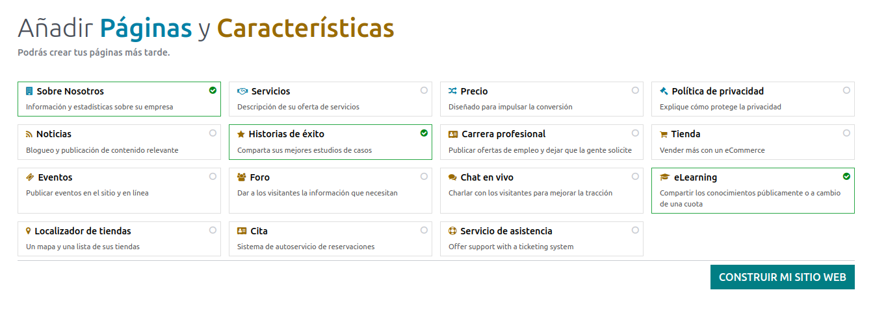

# Start whit 🚀 odoo 🚀 

## Despliegue en la nube ☁️

Para realizar un despliegue en la nube 

1. necesitamos una cuenta en odoo 

  - solo necesitamos seguir los pasos [aqui](https://www.odoo.com/web/login)

  

2. hacer un despliegue sencillo en odoo
  - pulsamos sobre el boton `Try it free`
  - se nos mostrara una serie de servicios que nos da odoo, para este ejemplo usaremos un website

  
  
  - rellenamos como se va a llamar nuestra app y lo que nos haga falta y aceptamos
  

  - seguimos el tutorial
  

  - una vez finalizado el tutorial podemos ver nuestra web y compartir el enlace 
  # 

3. Comenzar a dar funcionalida a nuestra aplicacion mediante modulos o siguiendo los tutoriales de odoo

## Despliegue en un servidor local
<!-- TODO -->
## Despliegue en máquina virtual de un servidor local 
## Despliegue con sistema de servidor de aplicaciones en local usando contenedores (docker)
## Crear y subir un documento con la información pedida para presentárselo a una posible empresa cliente. (1 punto)

Como segunda parte de esta actividad, realizaremos un despliegue de Odoo 14 utilizando docker (opción 4 de las propuestas arriba). Para ello debes tener en cuenta los siguientes pasos:

        - Instala docker en tu sistema. Si ya tienes conocimientos sobre docker, puedes utilizar la forma que prefieras para instalarlo: (1 punto)

Windows 10, versión que quieras, utilizando wsl o no.
Linux
       Si no lo conoces, te aconsejo que sigas el pie de la letra el documento propuesto.

       - Una vez hayas completado la instalación de docker, inicia la aplicación Odoo versión 14, utilizando para ello docker-compose, que también está explicado en el documento propuesto.

       - Como respuesta a esta actividad añade al documento anterior, capturas de pantalla que recojan la siguiente información:
Sistema operativo elegido, versión y si han usado o no el subsistema wsl. (1 punto)
Una captura de pantalla donde se muestren los contenedores de Odoo iniciados. (1 punto)
Una captura de pantalla con la web de presentación de la aplicación Odoo. (1 punto)
       - Incluye también en el documento las adaptaciones y operaciones que has tenido que realizar en tu sistema operativo para conseguir una implantación idónea de Odoo 14. (1 punto) 